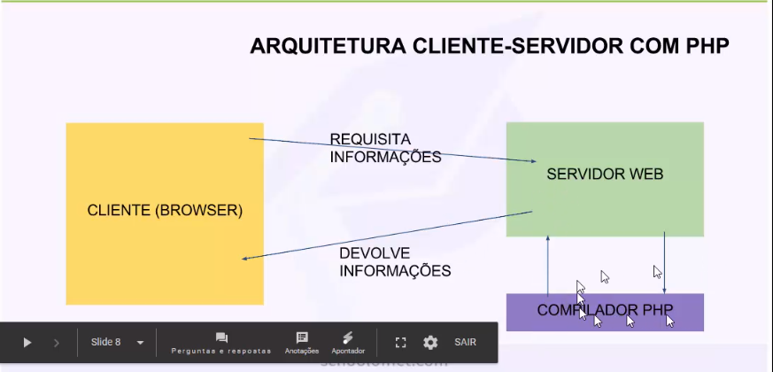

# PHP Básico (Atualização 2)

https://www.schoolofnet.com/curso/php/linguagem-php/iniciando-com-php/

---

## <a name="indice">Índice</a>

- [Introdução](#parte1)   
- [Dicas para iniciantes com PHP](#parte2)   
- [Instalando PHP no Windows](#parte3)   
- [Instalando PHP no Linux](#parte4)   
- [Instalando PHP no MAC](#parte5)   
- [Qual IDE devo usar](#parte6)   
- [Primeiro exemplo com PHP](#parte7)   
- [Operadores aritméticos](#parte8)   
- [Variáveis e tipos de dados](#parte9)   
- [Como o compilador do PHP trabalha](#parte10)   
- [Strings](#parte11)   
- [Precedências](#parte12)   
- [Comentários](#parte13)   
- [Arrays](#parte14)   
- [Arrays com chaves e valores](#parte15)   
- [PHP no browser](#parte16)   
- [PHP com HTML](#parte17)   
- [Passando informações entre páginas](#parte18)   


---

## <a name="parte1">Introdução</a>

O PHP (um acrônimo recursivo para PHP: Hypertext Preprocessor) é uma linguagem de script open source de uso geral, muito utilizada, e especialmente adequada para o desenvolvimento web e que pode ser embutida dentro do HTML.


[Voltar ao Índice](#indice)

---

## <a name="parte2">Dicas para iniciantes com PHP</a>

- http://www.php.net/
- http://www.zend.com/

[Voltar ao Índice](#indice)

---

## <a name="parte3">Instalando PHP no Windows</a>

```
php -v
PHP 7.2.1 (cli) (built: Jan  4 2018 04:29:12) ( ZTS MSVC15 (Visual C++ 2017) x86 )
Copyright (c) 1997-2017 The PHP Group
Zend Engine v3.2.0, Copyright (c) 1998-2017 Zend Technologies
```

[Voltar ao Índice](#indice)

---

## <a name="parte4">Instalando PHP no Linux</a>


[Voltar ao Índice](#indice)

---

## <a name="parte5">Instalando PHP no MAC</a>


[Voltar ao Índice](#indice)

---

## <a name="parte6">Qual IDE devo usar</a>

- https://code.visualstudio.com/

[Voltar ao Índice](#indice)

---

## <a name="parte7">Primeiro exemplo com PHP</a>

01-PHP-Basico\primeiro-exemplo.php

```php
<?php

echo 'School of net ';
echo 'Iniciando com PHP';
echo 450;
echo 1000.02;
```

[Voltar ao Índice](#indice)

---

## <a name="parte8">Operadores aritméticos</a>

- 01-PHP-Basico\08-Operadores-aritmeticos.php

```php
<?php
echo -10 - 4 - 100; // -114
echo "\n";

echo 4 + 3; // 7
echo "\n";

echo 4 + (3 - 2); // 5
echo "\n";

echo 5 * 6; // 30
echo "\n";

echo 5 / 6; // 0.83333333333333
echo "\n";

echo 4 * 5 / (6 + 3); // 2.2222222222222
echo "\n";

echo 5 / 0; // Warning: Division by zero in \01-PHP-Basico\08-Operadores-aritmeticos.php on line 14
echo "\n";

echo 2 ** 3; // 8
echo "\n";

echo 5 % 3; // 2
echo "\n";
```


[Voltar ao Índice](#indice)

---

## <a name="parte9">Variáveis e tipos de dados</a>

- 01-PHP-Basico\09-Variaveis-e-tipos-de-dados.php

```php
<?php

$nome = "School of Net";
echo $nome;

$nome = 'Iniciando com PHP';
echo "\n";
echo $nome;

$nome = 5000;
echo "\n";
echo $nome;

$numero = 5000;
echo "\n";
echo $numero;

$NOME = 'school of net';
$NOME234 = 'school of net outra variavel';
$nome2213nome = 'asdfasdf';
$primeiro_nome = 'luiz';
$primeiroNome = 'luiz';
$variavelTrue = true; //booleano
$variavelFalse = false;
echo "\n";

echo $variavelTrue;
echo "\n";
echo $variavelFalse;

/*
School of Net
Iniciando com PHP
5000
5000
1
 */
```

[Voltar ao Índice](#indice)

---

## <a name="parte10">Como o compilador do PHP trabalha</a>


[Voltar ao Índice](#indice)

---

## <a name="parte11">Strings</a>

- 01-PHP-Basico\11-string.php

```php
<?php

echo "alsdjflksjdhfksdjfhkjh";
echo "\n";

$variavel = "School of Net
asdfhgasjkdhfgajksdhfghjsdgfhjasdgfjasdgf
asdfasdfasdfasdfasdfasdfasdf
asjlkdfhalskdjfhalsjkdfhalskdjfhalsdkfjhasldkfjh
";
echo $variavel;
echo "\n";
$string1 = "School of Net";
$string2 = "Iniciando com PHP";
echo $string1 . $string2;
echo "\n";
echo "Luiz" . " Carlos";
echo "\n";
echo $string1 . ' ' . $string2;

$string3 = $string1 . ' ' . $string2;
$string3 = "School of Net Inciando com PHP";
$string4 = "$string1 $string2";

echo "\n";
echo $string4;
$string5 = '$string1 $string2';

echo "\n";
echo $string5;
```

```
 php .\11-string.php
alsdjflksjdhfksdjfhkjh
School of Net
asdfhgasjkdhfgajksdhfghjsdgfhjasdgfjasdgf
asdfasdfasdfasdfasdfasdfasdf
asjlkdfhalskdjfhalsjkdfhalskdjfhalsdkfjhasldkfjh

School of NetIniciando com PHP
Luiz Carlos
School of Net Iniciando com PHP
School of Net Iniciando com PHP
$string1 $string2
```


[Voltar ao Índice](#indice)

---

## <a name="parte12">Precedências</a>

- 01-PHP-Basico\12-precedencias.php

```php
<?php
$soma = 5 + 3 * 8;
$soma = 5 + 24;
$soma = 29;

//esquerda -------> direita

$string = "School of Net" . "Iniciando com PHP";
$string = "School of NetIniciando com PHP";

echo 5 + 3 * 8; // 29
echo "\n";
$soma = (5 + 3 * 5) * 8;
echo "\n";
echo $soma; // 160
```

[Voltar ao Índice](#indice)

---

## <a name="parte13">Comentários</a>

- 01-PHP-Basico\13-cometarios.php

```js
<?php
//Está sendo armazenado a soma de 5 com 3 na variável $variavel
//texto
//texto

$variavel = 5 + 3; //explicação

/* School of Net */

/*
 School of Net 
 asdfasdf
 asdfasdf
 asdfasdf
 asdfasdf
 asdfasdfsadf
 */

 // comentario de uma linha

 /* comentario multilinha */

 /****************************************************
 * 
 * Texto
 * 
 * 
 * 
 ****************************************************/

 /******* TEXTO *****************/
```

[Voltar ao Índice](#indice)

---

## <a name="parte14">Arrays</a>

- 01-PHP-Basico\14-arrays.php

```php
<?php
$array = array(40, 200, 100, 150, "School of Net", true);

//declaração flexível
$array = array(
    40,
    200,
    100,
    150,
    "School of Net",
    true
);

//echo $array;
//echo array(40,200,100,150,"School of Net",true);

echo $array[0] . "\n";
echo $array[1] . "\n";
echo array(40, 200, 100, 150, "School of Net", true)[4] . "\n";

$array1 = [
    45,
    210,
    110,
    160,
    "School of Ne1111111t",
    false
];
$array1[3];
```

[Voltar ao Índice](#indice)

---

## <a name="parte15">Arrays com chaves e valores</a>

- 01-PHP-Basico\15-arrays-chave-valor.php

```php
<?php
//array chaves - 0 1 2 3 4 5
//array - chaves e valores

$array = array(
    'luiz' => 40,
    200,
    100,
    3000 => 150,
    "School of Net",
    true
);

echo $array['luiz'];
echo "\n";

echo $array[1];
echo "\n";

echo $array[3000];
echo "\n";

//echo $array[2];
//echo "\n";
echo $array[3001];
echo "\n";


var_dump($array);

```

```
40
100
150
School of Net
array(6) {
  ["luiz"]=>
  int(40)
  [0]=>
  int(200)
  [1]=>
  int(100)
  [3000]=>
  int(150)
  [3001]=>
  string(13) "School of Net"
  [3002]=>
  bool(true)
}
```

[Voltar ao Índice](#indice)

---

## <a name="parte16">PHP no browser</a>



[Voltar ao Índice](#indice)

---

## <a name="parte17">PHP com HTML</a>

- 01-PHP-Basico\17-php-html.php

```php
<?php 
$nome = "José Malcher jr";
$html = "<h1>Iniciando com PHP</h1>";
?>
<html>
    <head></head>
    <body>
        <?php 
        //echo 5 + 3;
        echo $nome;
        ?>
        <?php echo $nome; ?>
        <?php echo $html; ?>
    </body>
</html>
```

[Voltar ao Índice](#indice)

---

## <a name="parte18"></a>


[Voltar ao Índice](#indice)

---
